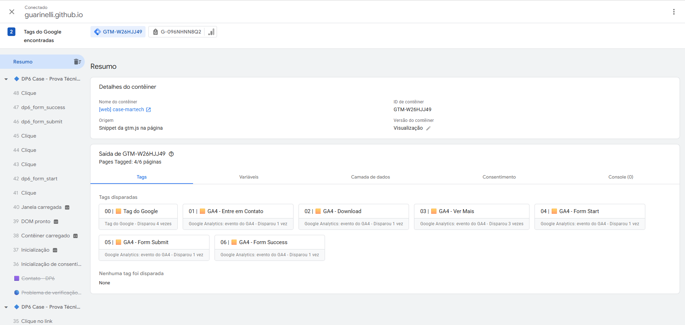

# Case Técnico – DP6 | Implementação de Tracking com Google Tag Manager e Google Analytics 4 (GA4)

Este repositório contém a solução desenvolvida para o Case Técnico da DP6, com foco na implementação de mensuração utilizando **Google Tag Manager (GTM)** e **Google Analytics 4 (GA4)**.

## Objetivo

Implementar os eventos especificados no PDF do desafio, realizando a coleta dos dados por meio do Google Tag Manager e o envio para o Google Analytics 4, seguindo a estrutura de eventos e parâmetros solicitada.

## Arquivos da entrega

Além do código-fonte, este repositório contém o arquivo de exportação do contêiner do Google Tag Manager utilizado na implementação:

- `GTM-W26HJJ49_container_export.json`

## Tecnologias utilizadas

- Google Tag Manager (Web)
- Google Analytics 4 (GA4)
- JavaScript
- HTML5
- GitHub Pages

## Eventos implementados

- Clique no menu **Entre em Contato**
- Clique no menu **Download PDF**
- Clique no botão **Ver Mais** (Lorem, Ipsum e Dolor)
- Inicio do preenchimento do formulário **Form Start**
- Envio do formulário **Form Submit**
- Enviado com sucesso o formulário **View Form Success**

## Validação

A implementação foi validada utilizando:

- Google Tag Manager Preview
- GA4 DebugView
- Inspeção dos payloads (Network) 
- Relatório de Eventos do Google Analytics 4

## Evidência
Abaixo, exemplo da validação realizada no modo Preview do Google Tag Manager:

## Projeto publicado

**GitHub Pages**

https://guarinelli.github.io/case-martech

**Repositório**

https://github.com/guarinelli/case-martech

## Observação

Quando a mensuração é realizada via Google Tag Manager, recomenda-se revisar as configurações de **Métrica otimizada** e de **Gerenciar detecção automática de eventos** na propriedade do Google Analytics 4, evitando a coleta automática de eventos que possam gerar duplicidades.

